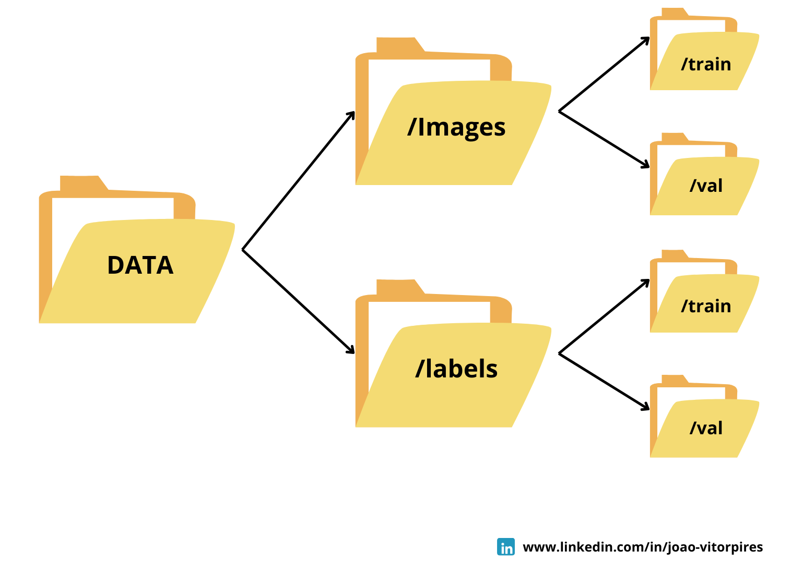

# Detector de Objetos - NEXT 2024: YOLOv5 e ESP32-CAM

## Introdução
O projeto foi desenvolvido para solucionar a necessidade de identificar pessoas em situações de risco durante enchentes, como as que ocorreram em abril de 2024 no estado do Rio Grande do Sul. Esse tipo de desastre natural frequentemente resulta em dificuldades para localizar pessoas em áreas inundadas, dificultando operações de resgate e aumentando os riscos para as equipes envolvidas.

Utilizando o modelo de detecção de objetos **YOLOv5** e o módulo **ESP32-CAM**, o sistema é capaz de identificar e localizar pessoas em tempo real em cenários de enchente, proporcionando suporte crucial para equipes de resgate.

---

## Organização dos Dados

Devido à limitação de dados disponíveis, optei por dividir o conjunto de dados em uma proporção de **70/30** para o treinamento e validação do modelo.

### Descrição dos Componentes:

- **Pasta `/images/train`**: Armazena as imagens destinadas ao treinamento do modelo, representando 70% do conjunto de dados. Essas imagens são usadas para ajustar os pesos do modelo durante o processo de aprendizado.

- **Pasta `/images/val`**: Armazena as imagens usadas para validação do modelo, representando 30% do conjunto de dados. O modelo é testado nessas imagens durante o treinamento para verificar o desempenho em dados que ele ainda não viu.

- **Pasta `/labels/train`**: Armazena os arquivos de **labels** correspondentes às imagens de treino. Cada arquivo de label segue o formato do YOLO (classe, x_center, y_center, width, height), indicando a classe e a posição dos objetos nas imagens.

- **Pasta `/labels/val`**: Armazena os arquivos de **labels** correspondentes às imagens de validação. Eles são usados para avaliar a precisão das detecções do modelo nas imagens do conjunto de validação.

Essa estrutura de diretórios facilita a gestão dos dados durante o treinamento e validação do modelo, assegurando que tanto as imagens quanto as labels estejam organizadas de forma otimizada para o processo de aprendizagem.
